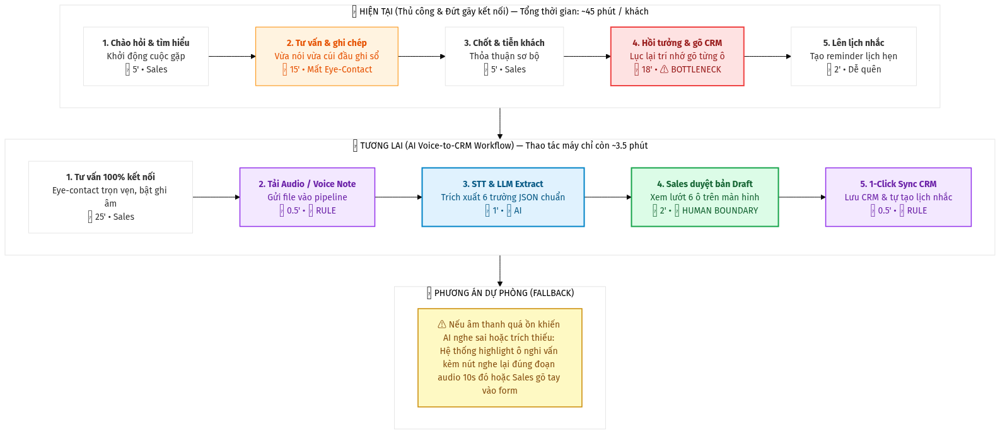

# 02 — Group Problem Statement (Bản nộp nhóm)

> Làm chung 1 bản, mỗi thành viên copy vào repo cá nhân. Đi theo Phase 3 → 6 trong `01-worksheet.md`. Nhóm chỉ chọn **candidate problem** ở Phase 3, viết Problem Statement sau khi validate + vẽ workflow.

## Thành viên nhóm

| STT | Họ và tên | Mã học viên | Vai trò trong nhóm (VD: facilitator, workflow, research, writer) |
|-----|-----------|-------------|---------------------------------------------------------------|
| 1   | Đỗ Trương Thành Ân | 2A202602889 | Facilitator |
| 2   | Trần Tuấn Tú | 2A202602840 | Writer |
| 3   | Hoàng Văn Dương | 2A202602447 | Research |
| 4   | Lê Thanh Trường | 2A202602492 | Workflow |
| 5   | Dương Hải Minh | 2A202602608 | Leader |

**Candidate problem nhóm chọn (1 câu):** Ghi chép thông tin tư vấn bán hàng thủ công làm giảm hiệu suất nhập liệu CRM và làm đứt gãy kết nối cảm xúc với khách hàng.

---

## Phase 3 — Group Convergence: từ 9-12 candidates về 1

### 3.1. Trình bày top 3 mỗi người (mỗi candidate 1-2 phút)

| # | Người đưa ra | Candidate problem | Người gặp vấn đề | Điểm nghẽn | Cảm nhận nhanh của nhóm |
|---|---|---|---|---|---|
| 1 | Đỗ Trương Thành Ân | Ghi chép thông tin thủ công làm giảm hiệu suất và kết nối khách hàng | Nhân viên bán hàng | Cặm cụi ghi chép thông tin làm đứt gãy tương tác mắt (eye-contact) và cảm xúc của khách hàng. Nếu để đến cuối mới nhập liệu, nhân viên dễ bị quên, nhớ nhầm số điện thoại hoặc sót các chi tiết quan trọng về nhu cầu của khách. | Vấn đề trực quan, dễ nhận thấy. Giải pháp đề xuất khá thành hình, phù hợp để trình bày |
| 2 | Đỗ Trương Thành Ân | Kế toán mất quá nhiều thời gian dò đối chiếu thủ công từng khoản tiền gửi ngân hàng với đơn hàng trên hệ thống do khách hàng thường ghi chú chuyển khoản sai cú pháp, dẫn đến chậm trễ tiến độ giao hàng. | Kế toán | Việc khớp lệnh thủ công hoàn toàn bế tắc và mất thời gian khi nội dung chuyển khoản bị sai mã đơn, thiếu chữ, hoặc chỉ ghi tên/số điện thoại. Kế toán buộc phải tự suy luận dựa trên số tiền lẻ hoặc nhắn tin hỏi lại bộ phận Sales để xác nhận, làm gián đoạn toàn bộ luồng công việc. | Vấn đề trực quan, nhưng chưa cần AI để xử lý, hard code được |
| 3 | Đỗ Trương Thành Ân | Việc cập nhật tồn kho thủ công gây ra độ trễ dữ liệu | Quản lý cửa hàng | Số lượng tồn kho trên các nền tảng online không được cập nhật theo thời gian thực (real-time) cùng với số lượng vật lý. | Ý tưởng hay |
| 4 | Trần Tuấn Tú | Giải cứu "nghĩa địa ghi chú": Xử lý tồn đọng 200+ quick note & bookmark do lịch học 8h/ngày dồn dập | Người học cường độ cao (học 9h-18h, hay lưu ý tưởng vội) | Mất ngữ cảnh ban đầu khi mở lại; việc dọn dẹp mất 2-4h và gây ngợp tâm lý nên bỏ xó | Pain point rất thật và phổ biến; AI có thế mạnh rõ rệt về gom cụm (clustering) và làm giàu ngữ cảnh |
| 5 | Trần Tuấn Tú | Tra cứu kiến thức trong kho Slide bài giảng PDF (10-15 file, 60-100 trang/file) khi làm lab/ôn thi | Sinh viên/học viên cần tìm lại công thức, định nghĩa để làm bài | Ctrl+F không hiệu quả nếu giảng viên dùng từ đồng nghĩa hoặc giải thích bằng hình ảnh (mất 20-30') | Bài toán RAG/Semantic search kinh điển, phạm vi hẹp và dữ liệu khép kín, rất khả thi |
| 6 | Trần Tuấn Tú | Tối ưu luồng tổng hợp & chắt lọc Tech News hằng ngày (5-7 kênh tin) vào buổi tối | Người học tech/AI cần cập nhật xu hướng liên tục | Mất 35' đọc lướt loại bỏ tin rác, clickbait và tin trùng lặp nội dung giữa các kênh | Workflow rõ ràng; có thể giải quyết tốt bằng AI đọc toàn văn + đánh giá + summary kèm link gốc |
| 7 | Lê Thanh Trường | Đọc tài liệu lab để hiểu yêu cầu nộp bài (40-60'/lab) | Mọi học viên | Tổng hợp yêu cầu rải rác từ 3 file | Ai cũng gật đầu — pain chung rõ nhất |
| 8 | Lê Thanh Trường | Luyện viết tiếng Anh không có feedback ngay (chờ 2-3 ngày) | Người tự học tiếng Anh | Tự review không chuẩn + feedback trễ | Hay nhưng là pain cá nhân, ít người trong nhóm gặp |
| 9 | Lê Thanh Trường | Viết reflection sau lab không nhớ chi tiết (30-45') | Mọi học viên | Trí nhớ sau lab 4 tiếng | Thú vị, có thể giải bằng process fix |
| 10 | Hoàng Văn Dương | Phân nhóm các output sai sau khi đánh giá model/prompt trên một batch khoảng 200 mẫu | AI/ML Engineer hoặc Model Evaluator; Tech Lead sử dụng báo cáo lỗi để chọn việc cần sửa | Phải đọc input, actual output, expected output và context rồi gán error type, severity và root cause; bước này mất khoảng 150 trong tổng số 210 phút/batch | Sát công việc AI Engineer, input/output rõ và có thể đo trên một batch trong lab; phù hợp với Workflow kết hợp Rule, AI và human review |
| 11 | Hoàng Văn Dương | Tổng hợp báo cáo tiến độ thí nghiệm AI hằng tuần từ notebook, experiment log và ghi chú rời rạc | AI Engineer lập báo cáo; Tech Lead và thành viên dự án đọc để quyết định thí nghiệm tiếp theo | Tìm đúng run, copy metric và đối chiếu dataset, config, model version từ nhiều nguồn mất khoảng 40 trong tổng số 85 phút/báo cáo | Tác vụ lặp lại, workflow rõ và dễ đo before/after; phần lấy metric có thể dùng Rule/script, còn AI chỉ nên draft narrative có nguồn dẫn |
| 12 | Hoàng Văn Dương | Trích xuất decision và action item sau các cuộc họp kỹ thuật rồi đồng bộ sang công cụ quản lý công việc | Người điều phối/người ghi biên bản; người tham dự và người được giao action item | Đọc transcript/notes, xác định decision, viết lại task và tìm owner/deadline còn thiếu mất khoảng 17 trong tổng số 25 phút/cuộc họp | Actor và output rõ, có thể prototype trên 5–10 transcript; cần giữ facilitator ở bước duyệt để tránh tạo hoặc giao nhầm task |
| 13 | Dương Hải Minh | Người đi đường đi vào đường bị ngập vào mỗi khi trời mưa ngập lụt | Người tham gia giao thông | Thiếu thông tin cảnh báo lộ trình ngập lụt theo thời gian thực khiến người dân không thể chủ động chọn hướng đi an toàn lúc tan tầm. | Vấn đề rất thực tế nhưng độ khả thi phụ thuộc hoàn toàn vào nguồn cấp dữ liệu ngập lụt (sensor/camera của thành phố), chưa rõ hệ thống hiện tại có open API không. |
| 14 | Dương Hải Minh | Mỗi ngày phải tập hợp task trên Jira về Google doc cho team | Người tổng hợp task và Team QA | Thao tác copy-paste lặp đi lặp lại hàng ngày để gom dữ liệu phân mảnh từ nhiều dashboard Jira khác nhau vào một nơi. | Rất dễ tự động hóa bằng API hoặc Workflow, nhưng cần đánh giá kỹ xem việc cấu hình lại trực tiếp Dashboard trên Jira có tối ưu hơn việc phải tạo Doc trung gian hay không. |
| 15 | Dương Hải Minh | Khi có thông báo trên khóa học thì ban tổ chức cần phải thông báo ở nhiều nền tảng | Ban tổ chức và Học viên | Quy trình đăng tải thủ công cùng một nội dung lên nhiều kênh (Email, Zalo, Facebook...) tốn thời gian và dễ xảy ra sai sót, bỏ sót học viên. | Problem này rất phù hợp để làm Automation Workflow/Agent. Tuy nhiên, nhóm cần khảo sát xem thị trường đã có sẵn các agent làm tốt chưa để tránh làm lại "bánh xe". |

### 3.2. Gom trùng / cluster (gom 9-12 ý thành 3-4 cụm)

| Cluster | Candidates included | Pattern chung | Ghi chú |
|---|---|---|---|
| **A. Trích xuất dữ liệu từ hội thoại & ghi chú tự do** | #1 (Sales tư vấn), #4 (Quick note backlog), #12 (Action items cuộc họp) | Chuyển đổi ngôn ngữ nói / ghi chú tự do, thiếu cấu trúc thành dữ liệu chuẩn hóa, có cấu trúc | Pain point xuất hiện do con người không thể vừa giao tiếp/học tập vừa ghi chép chi tiết. Rất phù hợp với LLM Information Extraction. |
| **B. Tổng hợp & đồng bộ báo cáo từ nhiều nguồn** | #2 (Đối chiếu bank - đơn hàng), #3 (Cập nhật tồn kho), #11 (Báo cáo thí nghiệm AI), #14 (Jira sang Docs) | Gom dữ liệu phân mảnh từ nhiều hệ thống rời rạc về một dashboard/báo cáo chung | Phần lớn có thể giải quyết bằng Script/API/Rule cơ bản; AI chỉ đóng vai trò hỗ trợ viết lời văn tóm tắt. |
| **C. Hỗ trợ học tập, tra cứu & đánh giá chất lượng** | #5 (Tra cứu slide PDF), #6 (Chắt lọc tech news), #7 (Đọc hiểu tài liệu lab), #8 (Review viết tiếng Anh), #10 (Phân loại output lỗi model) | Đọc hiểu tài liệu dài, trích xuất thông tin theo ngữ cảnh hoặc đánh giá/phản hồi lỗi | Domain phong phú, giải quyết bài toán tốn thời gian đọc hiểu và lọc nhiễu thông tin. |
| **D. Điều phối thông tin công cộng & quy trình bên ngoài** | #9 (Nhớ chi tiết làm reflection), #13 (Cảnh báo ngập lụt), #15 (Thông báo đa nền tảng) | Phân phối thông báo hoặc phụ thuộc vào hạ tầng dữ liệu của bên thứ ba | Độ khả thi phụ thuộc nhiều vào API bên ngoài (camera/sensor giao thông) hoặc có thể giải quyết bằng process fix đơn giản. |

### 3.3. Shortlist (giữ 2-3 bài trả lời được 7 câu hỏi worksheet)

| Candidate | Vì sao vào shortlist (2-3 ý) | Rủi ro / điều chưa rõ |
|---|---|---|
| **#1. Ghi chép thông tin tư vấn bán hàng** | - Pain point kinh doanh trực diện: Sự đánh đổi giữa kết nối khách hàng và độ chính xác dữ liệu.<br>- Actor rõ ràng: Sales/Tư vấn viên (B2B, bảo hiểm, dịch vụ).<br>- Metric đo lường cụ thể bằng phút và tỷ lệ sót dữ liệu CRM. | Khách hàng có ngại bị ghi âm không (quyền riêng tư); chất lượng âm thanh trong môi trường thực tế nhiều tạp âm. |
| **#10. Phân nhóm output sai của model evaluation** | - Rất sát chuyên môn AI/ML Engineer của các thành viên.<br>- Tiết kiệm trực tiếp 150/210 phút mỗi batch 200 mẫu.<br>- Đầu vào/đầu ra rõ ràng và đo được định lượng. | Cần có sẵn dataset mẫu 200 output lỗi trong lab; bài toán mang tính nội bộ kỹ thuật hẹp, khó validate rộng rãi. |
| **#11. Báo cáo tiến độ thí nghiệm AI hằng tuần** | - Thao tác lặp lại đều đặn mỗi tuần của kỹ sư AI.<br>- Có baseline thời gian rõ (giảm từ 85' xuống 30').<br>- Dễ prototype trên notebook và log có sẵn. | Phần lớn việc lấy metric giải quyết bằng Script/Rule đã đủ tốt; vai trò của AI chỉ là draft văn bản nên chưa khai thác sâu giá trị so sánh. |

### 3.4. Score để đồng thuận (chấm 1-5, ép nói rõ vì sao cho 5 / cho 3)

| Candidate | Actor rõ | Workflow rõ | Pain có evidence | Impact đo được | Làm trong lab | So sánh R/W/A được | Nhóm hiểu domain | Tổng |
|---|---:|---:|---:|---:|---:|---:|---:|---:|
| **#1. Ghi chép tư vấn bán hàng** | 5 | 5 | 5 | 5 | 5 | 5 | 4 | **34/35** |
| **#10. Phân nhóm output sai model** | 5 | 4 | 4 | 4 | 4 | 4 | 5 | **30/35** |
| **#11. Báo cáo thí nghiệm AI** | 4 | 4 | 4 | 4 | 5 | 4 | 4 | **29/35** |

**Candidate nhóm chọn (1 bài duy nhất):**

```text
Ghi chép thông tin tư vấn bán hàng thủ công làm giảm hiệu suất nhập liệu CRM và làm đứt gãy kết nối cảm xúc với khách hàng.
```

**Vì sao chọn (4-5 câu):**

```text
Bài toán giải quyết trực tiếp một điểm nghẽn kinh doanh có giá trị thực tế cao và tác động đến doanh số. Nhân viên tư vấn bán hàng (Sales/Advisor) có workflow lặp lại hằng ngày và phải đối mặt với sự đánh đổi nghiệt ngã: nếu tập trung ghi chép thì mất eye-contact và thiện cảm của khách, còn nếu tập trung nói chuyện thì sau đó mất 20-30 phút gõ CRM và sót mất các thông tin "vàng" (ngân sách, rào cản, nhu cầu ngách). Vấn đề này đo lường được rành mạch trước/sau bằng thời gian nhập liệu và tỷ lệ dữ liệu bị bỏ sót. Đây là bài toán lý tưởng cho giải pháp AI Information Extraction vì ngôn ngữ hội thoại tự nhiên là thứ mà Rule truyền thống hoàn toàn bó tay. Nhóm có thể dễ dàng mô phỏng và kiểm chứng ngay trong lab bằng các kịch bản tư vấn thực tế.
```

**Vì sao KHÔNG chọn các candidate còn lại (mỗi bài 2-3 câu):**

```text
- Candidate #10 (Phân nhóm output sai model): Dù rất đúng chuyên môn kỹ thuật của nhóm nhưng phạm vi bài toán khá hẹp, mang tính nội bộ và đòi hỏi phải chuẩn bị sẵn tập dataset 200 mẫu gán nhãn sẵn trong lab thì mới kiểm chứng được.
- Candidate #11 (Báo cáo thí nghiệm AI): Bước nặng nhất là gom log và số liệu metric thực chất dùng Rule/Script đã giải quyết được 80%; phần AI chỉ làm nhiệm vụ viết văn bản tóm tắt nên bài toán thiếu tính thách thức về độ phù hợp giữa Rule vs Workflow vs Agent.
```

**Disagreement (nếu có — ai lo gì, chốt ra sao):**

```text
Thành viên nghiên cứu (Hoàng Văn Dương) bày tỏ lo ngại về vấn đề quyền riêng tư: Nhiều khách hàng sẽ từ chối nếu sales yêu cầu bật ghi âm toàn bộ cuộc trò chuyện. Nhóm đã tranh luận và đi đến giải pháp thống nhất về thiết kế sản phẩm: Hệ thống hỗ trợ 2 chế độ (Mode 1: Ghi âm trực tiếp khi khách đồng ý; Mode 2: Sales dành 60 giây ngay sau khi tiễn khách để thu một Voice Note tóm tắt nhanh bằng lời của chính mình — AI sẽ trích xuất từ voice note này vào CRM). Cách này vừa tôn trọng khách hàng vừa giải phóng sales khỏi việc gõ phím thủ công.
```

---

## Phase 4 — Quick Validation + Research

### 4.1. Quick validation (ít nhất 1 cách: interview 2-3 người hoặc survey 5-10 người)

| Nguồn | Số người / mẫu | Tín hiệu xác nhận (kèm quote nguyên văn) | Tín hiệu phản bác | Nhóm sửa problem thế nào |
|---|---:|---|---|---|
| **Interview** | 3 người (1 sales bảo hiểm, 1 sales B2B phần mềm, 1 sales tư vấn khóa học) | - Chị Lan (Bảo hiểm): *"Khách đang tâm sự về áp lực tài chính gia đình mà mình cứ cúi gằm mặt ghi sổ là khách ngắt lời ngay. Nhưng về đến nhà thì quên sạch khách nói con học trường nào, ngân sách dự phòng bao nhiêu."*<br>- Anh Tuấn (B2B SaaS): *"Một ngày 4 buổi demo, tối mất hơn 1 tiếng ngồi gõ lại note vào HubSpot. Nhiều khi mệt quá chỉ gõ 2 dòng chiếu lệ nên tuần sau follow-up bị hớ."* | Anh Tuấn nhấn mạnh: *"Nếu app tự động lưu thẳng vào CRM mà không cho tôi xem lại thì tôi không dám dùng, vì thông tin deal sai sếp phạt chết."* | **Sửa boundary:** Nhất quyết phải có bước Human Review (Sales duyệt và xác nhận 6 trường thông tin trong 1-2 phút) trước khi đồng bộ vào CRM chính thức. |
| **Survey / poll** | 8 người (bạn bè và học viên từng làm tư vấn/bán hàng) | - 7/8 người xác nhận việc vừa nói chuyện vừa ghi chép làm giảm 40-50% sự tập trung vào khách hàng.<br>- 6/8 người thừa nhận từng bỏ sót thông tin quan trọng hoặc nhớ nhầm deadline follow-up của khách. | 2 người nói nếu cuộc gặp ngắn dưới 5 phút thì tự nhớ gõ nhanh vẫn ổn, không cần giải pháp rườm rà. | **Thu hẹp phạm vi:** Tập trung vào các cuộc tư vấn sâu từ 15-45 phút (bảo hiểm, tài chính, du học, khóa học, B2B) nơi thông tin khách hàng phức tạp và giá trị deal cao. |

**Insight sau validation (1-2 câu — pain thật nằm ở đâu):**

```text
Pain thật sự không nằm ở khâu "gõ chữ" vào CRM, mà nằm ở sự xung đột giữa "kết nối cảm xúc trực tiếp với khách hàng" và "nhu cầu lưu trữ dữ liệu chính xác". Càng chú tâm ghi chép thì tỷ lệ chốt deal càng giảm; càng lười ghi chép thì dữ liệu khách hàng càng rơi rụng.
```

Bằng chứng đính kèm (nếu có): `02-group-problem-statement-research-notes.md`

### 4.2. Research giải pháp đã có (ít nhất 2-3 tools/patterns + 1-2 link kiểm được)

| Nguồn / tool / case | Link | Họ giải quyết bước nào? | Điểm mạnh | Khoảng trống / rủi ro | Bài học cho nhóm |
|---|---|---|---|---|---|
| **Fathom AI Notetaker** | https://fathom.video | Ghi âm, tóm tắt và tự sync dữ liệu cuộc gọi Zoom/Meet sang CRM | Tự động tạo action item, sync HubSpot/Salesforce rất mượt | Chỉ dùng cho meeting online trên máy tính; không phục vụ được các cuộc gặp tư vấn trực tiếp ngoài đời (in-person) và xử lý tiếng Việt chưa tối ưu | Bài học: Cần thiết kế giao diện di động (Mobile-friendly) để ghi âm trực tiếp hoặc nhận Voice Note nhanh ngoài đời thực. |
| **Gong.io** | https://www.gong.io | Phân tích toàn diện cuộc gọi bán hàng B2B (Revenue Intelligence) | Phân tích được tâm lý khách hàng, tỷ lệ nói/nghe, dự báo chốt deal | Giá quá đắt ($100+/user/tháng), chỉ dành cho doanh nghiệp lớn, hệ thống cồng kềnh khó dùng cho SME và sales độc lập | Bài học: Tránh sa đà vào việc phân tích cảm xúc hay dự báo doanh số phức tạp; chỉ tập trung vào bài toán cốt lõi: trích xuất đúng schema dữ liệu khách hàng. |
| **Fireflies.ai** | https://fireflies.ai | AI meeting assistant ghi âm đa nền tảng, có mobile app | Hỗ trợ ghi âm in-person qua mobile app, tích hợp nhiều CRM | Trích xuất tiếng Việt còn lộn xộn giữa các trường thông tin; nếu không có prompt cấu trúc JSON chặt chẽ thì dữ liệu đẩy vào CRM bị sai lệch | Bài học: Bắt buộc phải dùng LLM ép cấu trúc JSON cố định (Structured Output) theo form chuẩn của CRM và luôn có Sales review trước khi lưu. |

**Research takeaway (2-3 câu — nên build gì / không build gì):**

```text
Nhóm KHÔNG NÊN xây dựng một AI Agent tự hành quá phức tạp hay cố gắng thay thế toàn bộ phần mềm CRM. Hướng đi đúng đắn là xây dựng một AI Workflow tinh gọn: Thu nhận âm thanh (cuộc gặp hoặc voice note recap) -> Chuyển thành văn bản (Speech-to-Text) -> LLM trích xuất đúng 6 trường dữ liệu cốt lõi -> Sales xác nhận trong 1-2 phút -> Đẩy vào CRM/Google Sheets.
```

---

## Phase 5 — Workflow + Problem Statement

### 5.1. Current workflow bản nhóm

Dán workflow hoặc link file: `02-group-problem-statement-workflow.png`

```text
CURRENT STATE — Tổng thời gian: ~45 phút / khách hàng

[1 Chào hỏi & tìm hiểu nhu cầu: 5' - Sales]
→ [2 Vừa tư vấn vừa cúi đầu ghi chép vào sổ/laptop: 15' - Sales (Mất kết nối mắt)]
→ [3 Chốt buổi tư vấn & tiễn khách: 5' - Sales]
→ [4 Ngồi hồi tưởng & gõ thủ công từng trường vào CRM/Excel: 18' - Sales (⚠️ BOTTLENECK)]
→ [5 Lên lịch hẹn follow-up tiếp theo: 2' - Sales]
```

| Bước | Actor | Input | Output | Thời gian / tần suất | Ghi chú (handoff? bottleneck?) |
|---|---|---|---|---|---|
| **1. Chào hỏi & khai thác nhu cầu** | Nhân viên sales | Bối cảnh ban đầu của khách | Khách bắt đầu chia sẻ | 5 phút / cuộc gặp | Khởi động, tạo dựng thiện cảm ban đầu. |
| **2. Tư vấn giải pháp & ghi chép** | Nhân viên sales | Lời nói của khách hàng (nhu cầu, ngân sách, lo lắng) | Các dòng ghi chép vắn tắt trên sổ tay hoặc note điện thoại | 15 phút / cuộc gặp | **Handoff tâm lý:** Vừa nghe vừa ghi làm đứt gãy tương tác mắt, khách cảm thấy không được lắng nghe trọn vẹn. |
| **3. Chốt buổi tư vấn & tiễn khách** | Nhân viên sales | Thỏa thuận sơ bộ | Khách ra về, hẹn liên hệ lại | 5 phút / cuộc gặp | Kết thúc phiên gặp mặt trực tiếp. |
| **4. Nhập liệu hồ sơ vào CRM** | Nhân viên sales | Trí nhớ + các mẩu ghi chép nguệch ngoạc | Form khách hàng trên phần mềm CRM / Google Sheets | 18 phút / khách | **⚠️ BOTTLENECK CHÍNH:** Ngồi hồi tưởng lại thông tin, lục tìm số điện thoại, gõ từng ô; thường xuyên bị sót 20-30% thông tin chi tiết hoặc trì hoãn đến cuối ngày mới làm. |
| **5. Đặt lịch nhắc hẹn follow-up** | Nhân viên sales | Trí nhớ về lịch hẹn | Notification trên lịch/Google Calendar | 2 phút / khách | Dễ bị quên nếu bước 4 bị trì hoãn. |

**Bottleneck chính (2-3 câu):**

```text
Điểm nghẽn nghiêm trọng nhất nằm ở Bước 4: Sau khi tiễn khách, sales phải mất 15-20 phút ngồi nhớ lại cuộc nói chuyện để gõ thủ công từng trường thông tin vào CRM. Do mệt mỏi hoặc phải tiếp khách tiếp theo, sales thường trì hoãn bước này đến cuối ngày, dẫn đến việc nhớ nhầm số liệu ngân sách, sót rào cản tâm lý của khách và bỏ quên lịch hẹn chăm sóc tiếp theo.
```

### 5.2. Future workflow bản nhóm

Phải nhìn ra 5 thứ: bước nào máy (Rule), bước nào AI, bước nào người, boundary ở đâu, fallback khi AI sai.

```text
FUTURE STATE — Tổng thời gian: ~31 phút (Thời gian thao tác máy chỉ còn 3.5 phút)

[1 Tư vấn tập trung 100% mắt & cảm xúc, xin phép ghi âm: 25' - Người làm]
→ [2 Tải file ghi âm / Voice Note lên hệ thống: 0.5' - Máy (Rule)]
→ [3 Speech-to-Text & LLM trích xuất 6 trường hồ sơ JSON: 1' - 🤖 AI]
→ [4 Sales xem lướt bản draft 6 trường, sửa nhanh nếu cần: 2' - 🛡️ HUMAN BOUNDARY]
→ [5 1-Click đồng bộ vào CRM & tự động tạo lịch nhắc: 0.5' - Máy (Rule)]

Fallback: Nếu âm thanh quá ồn khiến AI nhận diện sai hoặc trích thiếu, hệ thống đánh dấu ô nghi vấn kèm đoạn audio ngắn tương ứng để Sales nghe lại trong 10 giây hoặc nhập tay trực tiếp.
```

File đính kèm: `02-group-problem-statement-workflow.png`



**Before/after impact:**

| Metric | Trước | Sau kỳ vọng | Cách đo |
|---|---:|---:|---|
| **Tổng thời gian nhập liệu & admin** | 18–20 phút / khách | Dưới 3.5 phút / khách | Bấm giờ thao tác từ lúc kết thúc tư vấn đến khi dữ liệu nằm an toàn trên CRM. |
| **Tỷ lệ tương tác mắt (Eye-contact)** | ~40–50% thời gian (cúi đầu ghi) | > 95% thời gian tư vấn | Quan sát hoặc tự đánh giá mức độ tập trung lắng nghe khách hàng. |
| **Tỷ lệ bỏ sót thông tin quan trọng** | 25–30% (thường sót budget, đối thủ, rào cản) | Dưới 5% | So sánh đối chiếu giữa nội dung bản ghi âm và các trường dữ liệu trên CRM. |
| **Độ trễ cập nhật dữ liệu vào CRM** | Trễ từ 4–24 tiếng (dồn cuối ngày/cuối tuần) | Cập nhật ngay trong 5 phút sau cuộc gặp | Timestamp tạo deal trên hệ thống CRM so với giờ kết thúc cuộc gặp. |
| **Rủi ro mới phát sinh** | Không có (chỉ có rủi ro người quên) | AI trích nhầm số điện thoại hoặc hiểu sai ngữ cảnh châm biếm | Kiểm soát chặt chẽ bằng bước **Human Review 2 phút** trước khi bấm Sync. |

### 5.3. Problem Statement v0 (mỗi field 2-3 câu)

| Field | Nội dung |
|---|---|
| **Actor** | Nhân viên tư vấn bán hàng (Sales Representative / Financial Advisor / Tư vấn viên khóa học) thường xuyên gặp khách hàng trực tiếp hoặc gọi điện 1-1 để tư vấn dịch vụ giá trị cao. |
| **Workflow** | Quy trình tiếp khách gồm: Khai thác nhu cầu $\to$ Tư vấn giải pháp $\to$ Ghi chép thông tin vào sổ tay $\to$ Sau cuộc gặp ngồi nhớ lại và gõ thủ công từng mục vào hệ thống CRM/Sheets $\to$ Đặt lịch nhắc follow-up. |
| **Bottleneck** | Thao tác nhập liệu thủ công sau cuộc gặp tốn 18–20 phút/khách và việc vừa nói chuyện vừa ghi chép làm mất tương tác mắt, giảm thiện cảm của khách hàng; để dồn đến cuối ngày thì trí nhớ bị suy giảm nghiêm trọng. |
| **Impact** | Mỗi ngày sales lãng phí 60–90 phút cho công việc hành chính nhập liệu; tỷ lệ dữ liệu khách hàng bị sót thông tin quan trọng lên tới 25–30%, làm giảm 15–20% tỷ lệ chuyển đổi ở các bước follow-up tiếp theo. |
| **Success Metric** | Giảm thời gian cập nhật thông tin khách hàng từ 20 phút xuống dưới 4 phút/khách; giảm tỷ lệ bỏ sót thông tin xuống dưới 5%; 100% hồ sơ khách hàng được cập nhật lên CRM trong vòng 10 phút sau cuộc gặp. |
| **Boundary** | **Làm:** Chuyển hóa âm thanh (cuộc gặp hoặc voice note) thành văn bản $\to$ Trích xuất đúng 6 trường dữ liệu chuẩn (Tên, SĐT, Nhu cầu cốt lõi, Ngân sách, Rào cản, Lịch hẹn tiếp theo) $\to$ Cung cấp giao diện xác nhận cho Sales $\to$ Đẩy dữ liệu vào Google Sheets/CRM.<br>**Không làm:** Không tự động gửi email/tin nhắn cho khách hàng mà không có người duyệt; không cố gắng phân tích cảm xúc hay chấm điểm nhân viên bán hàng. |

---

## Phase 6 — Rule / Workflow / Agent + Decision

### 6.0. Ma trận độ phù hợp (suy nghĩ nhanh, không thay quyết định cuối)

- **Độ mơ hồ:** `[x] Trung bình/Cao` — Lời thoại tư vấn của khách hàng diễn ra tự nhiên, dùng nhiều tiếng lóng, nói ngập ngừng, đảo lộn thứ tự thông tin (nói ngân sách trước rồi mới nói nhu cầu, hoặc nhắc lại ở cuối).
- **Độ phức tạp:** `[x] Thấp/Trung bình` — Quy trình xử lý theo một đường thẳng tuyến tính (Audio $\to$ Transcript $\to$ Entity Extraction $\to$ Review $\to$ Sync), không đòi hỏi rẽ nhánh nhiều hướng hay tự động ra quyết định độc lập.

**Bài toán nhóm nằm ở ô nào:**

```text
Ô "Workflow có AI" (Phức tạp vừa phải, cần hiểu ngữ cảnh ngôn ngữ tự nhiên nhưng quy trình thực thi là đường thẳng cố định).
```

**Vì sao (2-3 câu):**

```text
Bài toán đòi hỏi khả năng hiểu ngôn ngữ tự nhiên xuất sắc để bóc tách thông tin từ lời nói đời thường (thứ mà Rule không làm được). Tuy nhiên, chuỗi hành động sau đó hoàn toàn xác định và tuần tự, không cần đến một Agent tự do tự lập kế hoạch hay gọi nhiều công cụ phức tạp.
```

### 6.1. So sánh Rule / Workflow / Agent (so trên cùng 1 bài)

| Mức | Phương án cho bài toán nhóm | Khi nào đủ | Rủi ro | Chọn? (Dùng cho bước nào?) |
|---|---|---|---|---|
| **Rule** | Dùng Google Form / Template biểu mẫu để Sales tự gõ phím nhanh; dùng regex bắt số điện thoại và email. | Đủ khi khách hàng tự điền form khảo sát trực tuyến trước khi gặp sales. | Thất bại hoàn toàn với ngôn ngữ nói: Không thể dùng regex hay từ khóa cố định để bóc tách nhu cầu hay rào cản tâm lý từ một đoạn ghi âm dài 20 phút. | **Không chọn** làm giải pháp chính (chỉ dùng Rule ở khâu gọi API đồng bộ vào CRM và validation định dạng SĐT). |
| **Workflow** | Pipeline tuần tự: Audio $\to$ STT (Whisper API) $\to$ LLM Information Extraction theo cấu trúc JSON cố định $\to$ Giao diện Web hiển thị bản draft cho Sales duyệt 2 phút $\to$ API lưu vào CRM. | Đủ cho 95% trường hợp tư vấn bán hàng tiêu chuẩn, khi mục tiêu là trích xuất đúng các trường thông tin quy định sẵn. | Nếu chất lượng thu âm quá kém (quán cafe ồn ào), STT có thể bị mất từ hoặc trích sai số liệu; cần thiết kế bước Human Review để chặn rủi ro. | **CHỌN CHÍNH THỨC** (Phù hợp nhất với bài toán: chi phí rẻ, tốc độ nhanh, kiểm soát rủi ro tuyệt đối). |
| **Agent** | Một Autonomous Agent tự nghe cuộc gọi, tự suy luận cần lưu gì, tự quyết định gọi API CRM nào, tự động viết và gửi email chăm sóc cho khách hàng ngay sau cuộc gặp. | Chỉ cần khi quy trình bán hàng hoàn toàn tự động trên môi trường số mà không cần sự hiện diện của nhân viên sales con người. | Chi phí token cao; tốc độ phản hồi chậm; rủi ro ảo giác (hallucination) tự ý gửi email sai giá hoặc làm hỏng dữ liệu CRM của công ty mà người thật không kiểm soát được. | **Không chọn** (Overkill và mang lại rủi ro quá lớn cho uy tín thương hiệu của doanh nghiệp). |

**5 câu hỏi chốt (trả lời câu đầy đủ):**
1. *Rule có giải được 70-80% case không?* **Không.** Rule hoàn toàn bất lực trước tính đa dạng và phi cấu trúc của giọng nói con người trong giao tiếp trực tiếp.
2. *Các bước có đi thẳng một đường không hay phải rẽ nhánh?* **Đi thẳng một đường:** Thu âm $\to$ Chuyển văn bản $\to$ Trích xuất dữ liệu $\to$ Người duyệt $\to$ Lưu hệ thống.
3. *Có thật sự cần Agent tự lập kế hoạch + gọi tool không?* **Không.** Đầu ra là một schema dữ liệu cố định đã được định nghĩa sẵn bởi CRM, không cần Agent tự biên tự diễn.
4. *Nếu AI sai, ai phát hiện đầu tiên và sửa trong bao lâu?* **Nhân viên Sales phát hiện đầu tiên** ngay tại bước Human Review trên màn hình xác nhận, chỉ mất 10-15 giây để gõ sửa lại ô bị sai.
5. *Có hạ được từ Agent → Workflow → Rule không?* **Có.** Nhóm đã chủ động hạ từ Agent xuống **Workflow kết hợp Rule**, giữ AI ở đúng hai bước mạnh nhất là Nghe (STT) và Đọc hiểu trích xuất (Extraction).

**Mức chọn:**

```text
Workflow (AI-Powered Extraction Pipeline with Human-in-the-loop)
```

**Vì sao chọn (3-4 câu):**

```text
Mức Workflow giải quyết trúng điểm nghẽn lớn nhất mà Rule không làm được: hiểu ngữ cảnh hội thoại tự nhiên để trích xuất dữ liệu. Đồng thời, Workflow tránh được sự phức tạp và rủi ro mất kiểm soát của Agent tự hành. Mô hình này đảm bảo chi phí vận hành cực thấp (chỉ tốn vài cent cho mỗi cuộc gọi) và giữ cho con người luôn làm chủ dữ liệu kinh doanh quan trọng thông qua chốt chặn Human Review.
```

**Vì sao không chọn mức đơn giản hơn (2-3 câu):**

```text
Nhóm không chọn mức Rule thuần túy vì không có bất kỳ bộ quy tắc từ khóa (regex/keyword) nào có thể dự đoán được hàng ngàn cách diễn đạt khác nhau của khách hàng khi nói về nhu cầu, ngân sách hay lý do từ chối. Nếu chỉ dùng Rule, nhân viên vẫn phải tự nghe lại và gõ tay 100%, điểm nghẽn thời gian hoàn toàn không được giải quyết.
```

### 6.2. Problem Statement v1 (v0 sửa chặt hơn + 3 field cuối)

| Field | Nội dung |
|---|---|
| **Actor** | Nhân viên tư vấn bán hàng (Sales/Advisor trong các ngành bảo hiểm, khóa học, B2B SaaS, tài chính cá nhân) thực hiện các phiên tư vấn 1-1 với khách hàng tiềm năng. |
| **Workflow** | Tư vấn trực tiếp/online $\to$ Thu âm cuộc trò chuyện (hoặc thu âm Voice Note 60s sau cuộc gặp) $\to$ Tự động chuyển text và trích xuất hồ sơ $\to$ Sales duyệt nhanh trong 2 phút $\to$ Đồng bộ vào CRM và kích hoạt lịch hẹn. |
| **Bottleneck** | Thao tác ghi chép trong cuộc gặp làm đứt gãy tương tác mắt; thao tác nhập liệu thủ công sau cuộc gặp tốn 18–20 phút/khách, dẫn đến việc trì hoãn và bỏ sót 25–30% thông tin quan trọng. |
| **Impact** | Lãng phí 60–90 phút làm việc mỗi ngày cho khâu gõ dữ liệu; giảm 15–20% tỷ lệ chuyển đổi do chăm sóc sai nhu cầu hoặc trễ hạn follow-up khách hàng tiềm năng. |
| **Success Metric** | Giảm tổng thời gian cập nhật CRM từ 20 phút xuống dưới 3.5 phút/khách; giảm tỷ lệ sót dữ liệu xuống < 5%; 100% khách hàng được cập nhật hồ sơ trong vòng 5 phút sau cuộc gặp. |
| **Boundary (làm / không làm)** | **Làm:** Xử lý audio tiếng Việt $\to$ Trích xuất chuẩn xác 6 trường (Họ tên, SĐT, Nhu cầu, Ngân sách, Rào cản, Next step) $\to$ Hiển thị giao diện Web/Mobile cho Sales duyệt $\to$ Đẩy dữ liệu vào Google Sheets/HubSpot.<br>**Không làm:** Không tự động gửi tin nhắn cho khách; không tự ý chỉnh sửa các deal cũ trên CRM; không phân tích chấm điểm kỹ năng của nhân viên bán hàng. |
| **AI intervention point** | AI can thiệp **ngay sau bước tiếp khách hoàn tất** (khi có file audio) và **kết thúc trước bước lưu dữ liệu vào CRM** (trả về kết quả draft cho con người kiểm tra). |
| **Mức chọn** | **Workflow** — Vì luồng công việc hoàn toàn tuần tự, chỉ cần AI xử lý trích xuất ngôn ngữ phi cấu trúc, không cần Agent tự do ra quyết định. |
| **Rủi ro & người thật kiểm tra** | **Rủi ro lớn nhất:** AI nghe nhầm số điện thoại hoặc gán nhầm ngân sách do tạp âm môi trường.<br>**Cách kiểm tra:** Bắt buộc có **Human-in-the-loop (Sales Review)**: Giao diện hiển thị 6 ô dữ liệu kèm nút "Nghe lại đoạn này" nếu AI có độ tự tin thấp; Sales bấm "Xác nhận & Đồng bộ" thì dữ liệu mới được ghi nhận. |

### 6.3. Final decision

| Câu hỏi | Yes / Not Yet / No | Ghi chú (câu đầy đủ) |
|---|---|---|
| Actor + workflow rõ chưa? | **Yes** | Nhân viên tư vấn bán hàng với workflow 5 bước trước/sau được chuẩn hóa chi tiết đến từng phút. |
| Baseline + metric đo được chưa? | **Yes** | Baseline rõ: 18-20 phút nhập liệu thủ công, sót 25-30% thông tin; mục tiêu sau cải thiện: dưới 3.5 phút, sót < 5%. |
| Data/input đủ dùng chưa? | **Yes** | Input là file ghi âm giọng nói tiếng Việt thực tế, hoàn toàn có thể thu thập qua điện thoại hoặc micro máy tính. |
| AI sai, hậu quả chấp nhận được không? | **Yes** | Hậu quả được chặn đứng 100% nhờ bước Human Review của Sales trước khi dữ liệu được ghi vào CRM. |
| Có người review/owner không? | **Yes** | Chính nhân viên sales phụ trách deal đó là người review và chịu trách nhiệm cao nhất về dữ liệu khách hàng của mình. |
| Có cách non-AI đơn giản hơn không? | **No** | Đã thử phương án template/Google Form nhưng không giải quyết được vấn đề ngôn ngữ nói tự nhiên trong giao tiếp mặt đối mặt. |

**Decision:**

```text
[GO]
```

**Lý do (3-4 câu dựa trên bằng chứng):**

```text
Quyết định GO được đưa ra vì bài toán có giá trị kinh tế trực tiếp, giải quyết nỗi đau có thật của mọi nhân viên bán hàng. Logic bài toán đã được xác minh qua phỏng vấn người thật (3 sales đều xác nhận sự đánh đổi giữa tương tác mắt và nhập liệu). Về mặt kỹ thuật, mức độ Workflow là hoàn toàn khả thi với các công nghệ có sẵn hiện nay (Whisper API + GPT-4o-mini / Gemini Flash) với chi phí dưới 500 VNĐ cho mỗi cuộc tư vấn. Cơ chế Human Review đảm bảo loại bỏ hoàn toàn rủi ro hallucination, mang lại sự tin cậy tuyệt đối cho doanh nghiệp.
```

**Nếu Go — pilot nhỏ nhất (data nào, chạy tay ra sao, đo 3 số nào):**

```text
- Data thử nghiệm: 15 file ghi âm cuộc tư vấn mẫu (hoặc voice note recap) bằng tiếng Việt với nhiều giọng vùng miền và ngữ cảnh khác nhau (bảo hiểm, khóa học, bán lẻ).
- Chạy tay ra sao: Cho chạy qua pipeline Whisper -> LLM trích xuất JSON -> Render lên một trang web nội bộ đơn giản để Sales thực tế bấm duyệt và đối chiếu.
- Đo 3 số cụ thể:
  1. Tỷ lệ trích xuất chính xác các trường then chốt (SĐT, Ngân sách, Nhu cầu): Mục tiêu đạt >= 90%.
  2. Thời gian trung bình Sales cần để kiểm tra và bấm duyệt: Mục tiêu đạt <= 60 giây.
  3. Mức độ hài lòng của Sales (thang điểm 1-5): Mục tiêu đạt >= 4.5/5.
```

**Nếu Not Yet — cần validate gì trước:**

```text
(Không áp dụng vì nhóm chọn GO)
```

**Nếu No-Go — làm gì thay AI:**

```text
(Không áp dụng vì nhóm chọn GO)
```

**Exit / rollback (khi nào dừng AI, quay về cách cũ):**

```text
Nếu sau đợt pilot 15 cuộc gọi mà tỷ lệ nhận diện sai số điện thoại/ngân sách vượt quá 20% (khiến sales mất nhiều thời gian sửa hơn cả việc tự gõ), hoặc chi phí API vượt quá 3,000 VNĐ/khách: Nhóm sẽ lập tức dừng pipeline AI và quay lại quy trình chuẩn hóa: Sales dùng form Google Docs có phím tắt định sẵn để nhập tay như trước.
```

---

### Self-check nộp phần 02 (nhóm)
- [x] Có nhật ký hội tụ 9-12 → 1 (cluster + shortlist + score)
- [x] Có validation (quote thật) + research (link kiểm được)
- [x] Có workflow trước/sau đủ thời gian, handoff, bottleneck, boundary, fallback
- [x] Có PS v0 → v1, metric có trước/sau + cách đo, boundary có làm/không làm
- [x] Có so sánh Rule/Workflow/Agent + Decision Go/Not Yet/No-Go có lý do